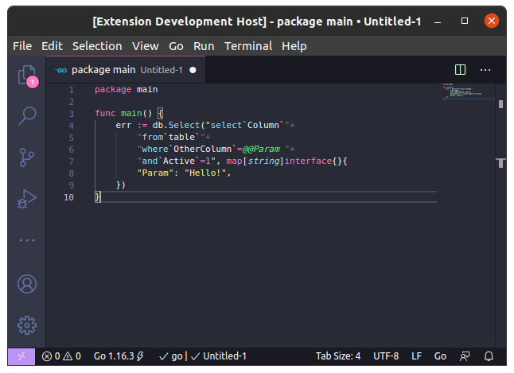

# Go MySQL Highlighter

Syntax highlights MySQL strings in Golang. Nothing more, nothing less.

Also handles highlighting across multiple lines, in case you write your queries that way (like we do).

